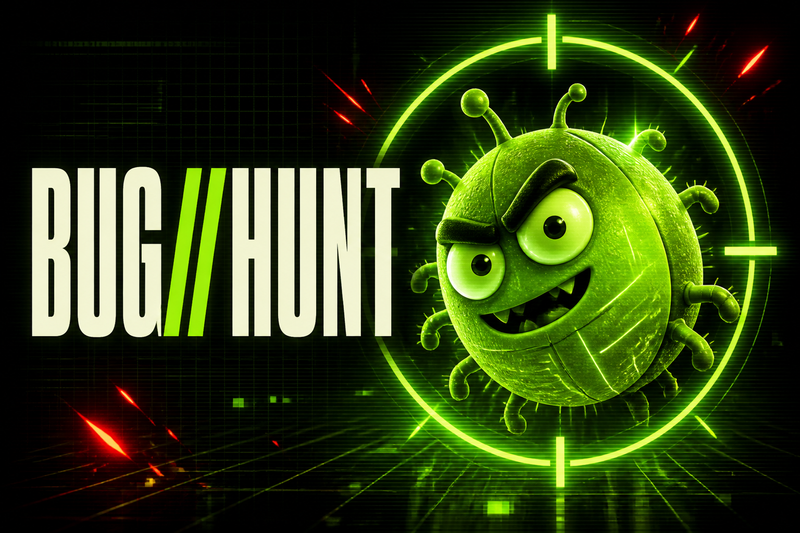

# BUG//HUNT — Охота на баги



Быстрая браузерная аркада, созданная в рамках обучения на GConf. Игроку нужно
поймать как можно больше зелёных багов за 45 секунд и не нажимать на красные
ловушки.

## Что есть в игре

- раунд на 45 секунд;
- три жизни;
- ускорение по мере прохождения;
- система комбо и дополнительных очков;
- сохранение лучшего результата в браузере;
- управление мышью, касанием и клавиатурой.

## Запуск локально

Требуется Node.js версии `22.13.0` или новее.

```bash
npm install
npm run dev
```

После запуска игра будет доступна по адресу `http://localhost:3000`.

## Проверка сборки

```bash
npm run build
```

## Технологии

- React 19;
- TypeScript;
- vinext и Vite;
- CSS-анимации;
- Cloudflare Workers-совместимая сборка.

## Автор

Учебный проект Евгения Осипова, созданный вместе с Codex.
